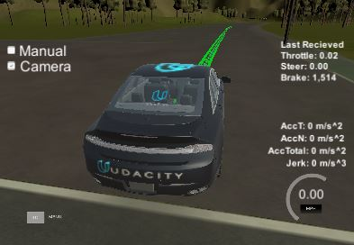

# Udacity Capstone Project
This is the project repo for the final project of the Udacity Self-Driving Car Nanodegree: Programming a Real Self-Driving Car. For more information about the project, see the project introduction [here](https://classroom.udacity.com/nanodegrees/nd013/parts/6047fe34-d93c-4f50-8336-b70ef10cb4b2/modules/e1a23b06-329a-4684-a717-ad476f0d8dff/lessons/462c933d-9f24-42d3-8bdc-a08a5fc866e4/concepts/5ab4b122-83e6-436d-850f-9f4d26627fd9).

## Team Doudoufei
* Yongzhi Liu (Team leader)
* Yan Zhang
* Yanyan PENG
* Rajiv Sreedhar
* Pradhap Moorthi

# Table of contents
[Overall Structure](#overall)
  * [Perception](#perception)
    + [Traffic Light Detection](#tl-detection)
    + [Traffic Light Classification](#tl-classification)
  * [Planning](#planning)
    + [Waypoint Loader](#waypoint-loader)
    + [Waypoint Updater](#waypoint-updater)
  * [Control](#control)
    + [DBW](#dbw)
    + [Waypoint Follower](#waypoint-follower)

[Environment](#env)
<!-- toc -->
<a name="overall"></a>
## Overall Structure
In this project, we used ROS nodes to implement the core functionality of the autonomous vehicle system, including traffic light detection, control, and waypoint following. The following is a system architecture diagram showing the [ROS](http://wiki.ros.org/) nodes and topics used in the project. 


<a name="perception"></a>
### Perception
In this project, the perception is mainly from camera images for traffic light detection. The self driving car for this project is mainly for highway or test site without any obstacle. So no obstacle detection is considered.

<a name="tl-detection"></a>
#### Traffic Light Detection (tl_detector.py + tl_classfier.py)
* Input: 
  * /image_color: colored images from camera,
  * /current_pose: the vehicle's current position,
  * /base_waypoints: a complete list of reference waypoints the car will be following,
* Output: 
  * /traffic_waypoint: the locations to stop for red traffic lights

The traffic light detection node is within the tl_detector.py, and the traffic light classification node is within /tl_detector/light_classification_model/tl_classfier.py.

To reduce the latency, we only allow the traffic light classification when the car is within 300 waypoints away from the closest traffic light.

<a name="tl-classification"></a>
#### Traffic Light Classification
The traffic light classification is more complicated than the deep learning and transfer learning we did in the course. The input camera images for the simulator or for the site test are not previously provided by Udacity. We chose to train our classification model based on existing object detection models such as ResNet and MobileNet that have already been tested and used successfully. These models can detect the traffic light box but cannot tell the color.

We have learned a lot about how to prepare data and training data from [Tensorflow Object Detection API](https://github.com/tensorflow/models/tree/master/research/object_detection) and these past Udacity students.
* [Jose Horas](https://github.com/josehoras/Self-Driving-Car-Nanodegree-Capstone)
* [Marco Marasca](https://github.com/marcomarasca/SDCND-Traffic-Light-Detection)

The images from simulator and test site are very different. Our traffic classification use one model for the simulator and one model for the test site. The training of the model includes three steps:
* Collecting images:
  * simulator: use the state of the /vehicle/traffic_lights in the simulator to get the ground truth images.
  * site: the images are from the rosbag.

* Labelling images: We used [LabelImg](https://github.com/tzutalin/labelImg) to label the collected images.

* Converting to TFRecord file: To use our own dataset in Tensorflow Object Detection API, we must convert it into the [TFRecord file format](https://github.com/tensorflow/models/blob/master/research/object_detection/g3doc/using_your_own_dataset.md).

* Training the model 


<a name="planning"></a>
### Planning 

The path planning for this project is simply to produce a trajectory that obeys the traffic light. The resulting waypoints
are the green points ahead of the car as shown in the snapshot below.




#### Waypoint Loader
A package which loads the static waypoint data and publishes to /base_waypoints.

<a name="waypoint-updater"></a>
#### Waypoint Updater (waypoint_updater.py)
The purpose of this node is to update the target velocity property of each waypoint based on traffic light data. The detected traffic light is used in this node to determine if the car need to stop for red light or continue to drive. The corresponding velocities are calculated for each waypoint ahead of the car.

* Input: 
  * /base_waypoints, 
  * /current_pose, 
  * /traffic_waypoint
* Output: 
  * /final_waypoints: a list of waypoints ahead of the car with target velocities.

<a name="control"></a>
### Control (dbw_node.py + twist_controller.py)
Carla is equipped with a drive-by-wire (dbw) system, meaning the throttle, brake, and steering have electronic control. This package contains the files that are responsible for control of the vehicle: the node dbw_node.py and the file twist_controller.py, along with a pid and lowpass filter.

<a name="dbw"></a>
#### DBW
This node should only publish the control commands when dbw_enabled is true to avoid error accumulation in manual mode. The DBW node uses a PID controller to control the throttle.

* Input:
  * /current_velocity
  * /twist_cmd: target linear and angular velocities. 
  * /vehicle/dbw_enabled: indicates if the car is under dbw or manual driver control. 
* Output:
  * /vehicle/throttle_cmd
  * /vehicle/brake_cmd
  * /vehicle/steering_cmd

<a name="waypoint-follower"></a>
#### Waypoint Follower
A package containing code from Autoware which subscribes to /final_waypoints and publishes target vehicle linear and angular velocities in the form of twist commands to the /twist_cmd topic. 

<a name="env"></a>
## Environment

Please use **one** of the two installation options, either native **or** docker installation.

### Native Installation

* Be sure that your workstation is running Ubuntu 16.04 Xenial Xerus or Ubuntu 14.04 Trusty Tahir. [Ubuntu downloads can be found here](https://www.ubuntu.com/download/desktop).
* If using a Virtual Machine to install Ubuntu, use the following configuration as minimum:
  * 2 CPU
  * 2 GB system memory
  * 25 GB of free hard drive space

  The Udacity provided virtual machine has ROS and Dataspeed DBW already installed, so you can skip the next two steps if you are using this.

* Follow these instructions to install ROS
  * [ROS Kinetic](http://wiki.ros.org/kinetic/Installation/Ubuntu) if you have Ubuntu 16.04.
  * [ROS Indigo](http://wiki.ros.org/indigo/Installation/Ubuntu) if you have Ubuntu 14.04.
* [Dataspeed DBW](https://bitbucket.org/DataspeedInc/dbw_mkz_ros)
  * Use this option to install the SDK on a workstation that already has ROS installed: [One Line SDK Install (binary)](https://bitbucket.org/DataspeedInc/dbw_mkz_ros/src/81e63fcc335d7b64139d7482017d6a97b405e250/ROS_SETUP.md?fileviewer=file-view-default)
* Download the [Udacity Simulator](https://github.com/udacity/CarND-Capstone/releases).

### Docker Installation
[Install Docker](https://docs.docker.com/engine/installation/)

Build the docker container
```bash
docker build . -t capstone
```

Run the docker file
```bash
docker run -p 4567:4567 -v $PWD:/capstone -v /tmp/log:/root/.ros/ --rm -it capstone
```

### Port Forwarding
To set up port forwarding, please refer to the "uWebSocketIO Starter Guide" found in the classroom (see Extended Kalman Filter Project lesson) or [instructions from term 2](https://classroom.udacity.com/nanodegrees/nd013/parts/40f38239-66b6-46ec-ae68-03afd8a601c8/modules/0949fca6-b379-42af-a919-ee50aa304e6a/lessons/f758c44c-5e40-4e01-93b5-1a82aa4e044f/concepts/16cf4a78-4fc7-49e1-8621-3450ca938b77).

### Usage

1. Clone the project repository
```bash
git clone https://github.com/udacity/CarND-Capstone.git
```

2. Install python dependencies
```bash
cd CarND-Capstone
pip install -r requirements.txt
```
3. Make and run styx
```bash
cd ros
catkin_make
source devel/setup.sh
roslaunch launch/styx.launch
```
4. Run the simulator

### Real world testing
1. Download [training bag](https://s3-us-west-1.amazonaws.com/udacity-selfdrivingcar/traffic_light_bag_file.zip) that was recorded on the Udacity self-driving car.
2. Unzip the file
```bash
unzip traffic_light_bag_file.zip
```
3. Play the bag file
```bash
rosbag play -l traffic_light_bag_file/traffic_light_training.bag
```
4. Launch your project in site mode
```bash
cd CarND-Capstone/ros
roslaunch launch/site.launch
```
5. Confirm that traffic light detection works on real life images

### Other library/driver information
Outside of `requirements.txt`, here is information on other driver/library versions used in the simulator and Carla:

Specific to these libraries, the simulator grader and Carla use the following:

|        | Simulator | Carla  |
| :-----------: |:-------------:| :-----:|
| Nvidia driver | 384.130 | 384.130 |
| CUDA | 8.0.61 | 8.0.61 |
| cuDNN | 6.0.21 | 6.0.21 |
| TensorRT | N/A | N/A |
| OpenCV | 3.2.0-dev | 2.4.8 |
| OpenMP | N/A | N/A |

